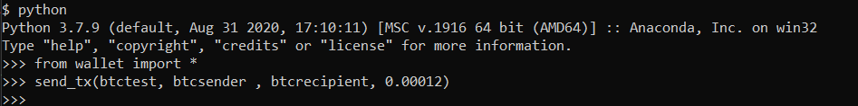
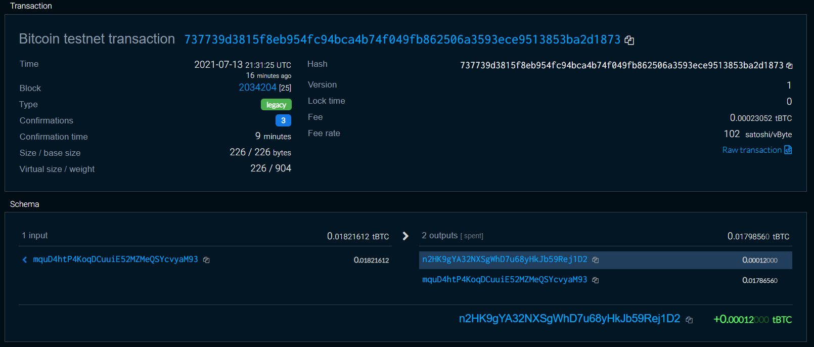
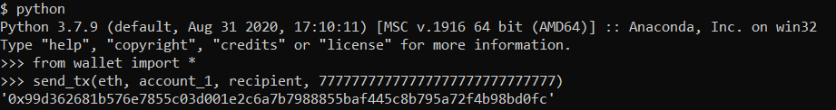
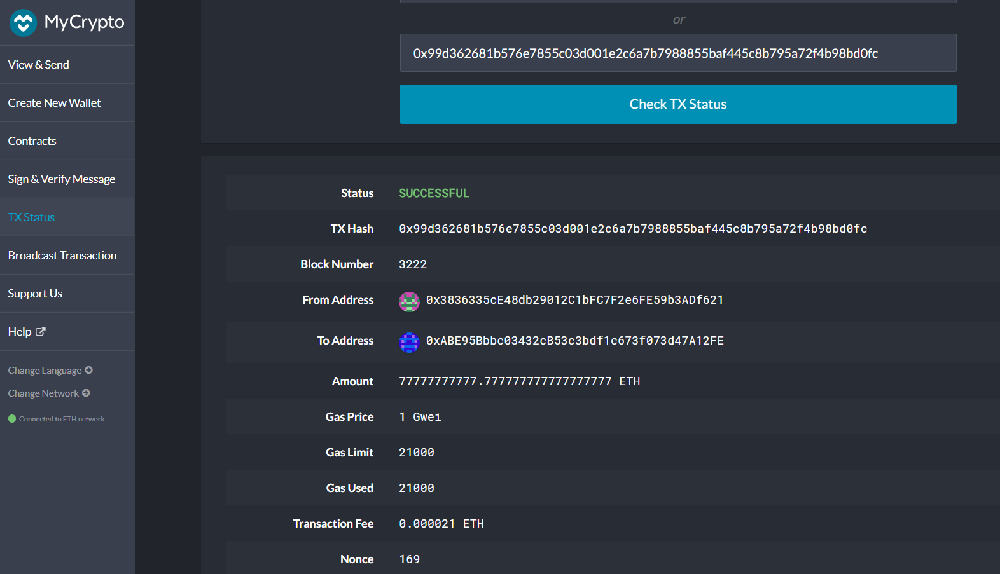

# Multi-Blockchain Wallet in Python

This assignment was to create a universal wallet to manage billions of addresses across 300+ crypto coins, which supports BIP32, BIP39, and BIP44. However, we only have 2 coins(BTCtest, ETH) in our wallet and we will be using BIP44 to derive wallet addresses. In order to send ETH transaction, you will need to run your Blockchain Network using your local host and port which will connect you to web3. In this demonstration, we will send transactions between wallet addresses via Python using CLI.

#

### You will be required to install the following dependencies:

* [vs-build-tools](https://visualstudio.microsoft.com/downloads/) (Be sure to select the build tools option when installing)
* [hd-wallet-derive library](https://github.com/dan-da/hd-wallet-derive) 
* [PHP](https://www.apachefriends.org/index.html)
* web3 == 5.17.0
* bit 
* MyCrypto

For additional Information on installing HD wallet, please follow the step by step video link below:
* [HD Derive Wallet Install for Windows](https://youtu.be/A_tqm4j4vsY)
* [HD Derive Wallet Install for Mac](https://youtu.be/c-Qc3Pss6oM)

To ensure your 'derive_wallets' function works, please folllow the [instructions](instructions.txt)

## **Bitcoin Testnet Transaction**

Please make sure you have BTCTEST coins in the sender's wallet before you proceed. You can do so here in the [testnet faucet](https://testnet-faucet.mempool.co/). In your CLI, type "python" and then from wallet import *, just like the image below. Now we can use the send_tx function to send a transaction. Once you send the transaction, you will not get any confirmation but you can check your wallet address you sent to.

You can check your transactions here with your wallet address:
[block explorer](https://tbtc.bitaps.com/) 

As you can see below in the right hand bottom corner, a transaction in the amount of 0.00012 has been received and confirmed succesfully.

## **Local PoA Ethereum transaction**

Sending transaction using your local PoA Ethereum Network. Once you activate your private blockchain network. Go into your CLI, type python, and from wallet import * and finally send a transaction.

Now, open MyCrypto app and login using your sender's private key, click on TX Status. Copy and paste the Hash Id and click Check TX Status. As you can see below, the transaction has been succesfuly mined in Block Number 3222.

